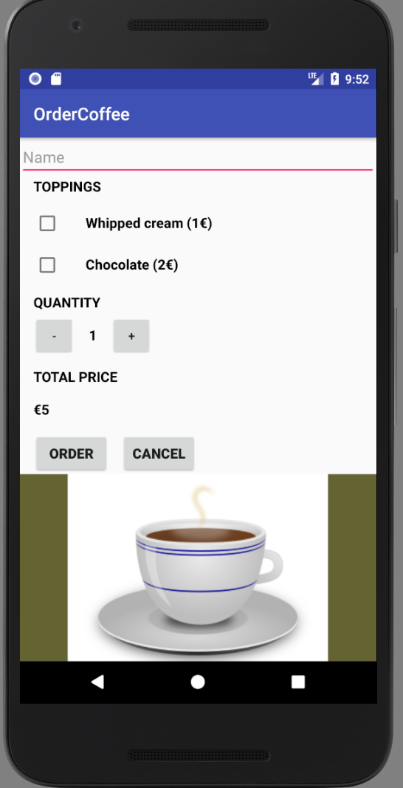
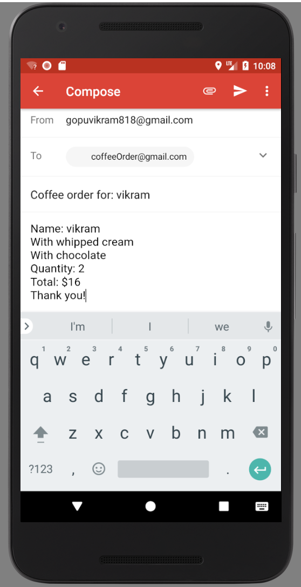

### This project is an excerise of Udacity course <b> Building Interactive Apps for Android </b>

 Here is the screen of the app which we can build at the end of this tutorial: 

 Here is the screen of the app while sending an order 

